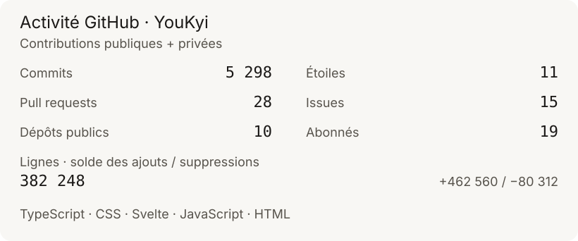

<!-- Identité : git/youkyi-brand · brand.md 1.0.0 · neutres mats, orange ponctuel. -->

[English](README.md) · **Français**

## Alexandre Agasseau · @YouKyi

Je suis administrateur système indépendant. Je travaille sur l’infrastructure et la sécurité défensive : Linux, conteneurs, réseau, identité et PKI.

J’automatise, je durcis et je documente. Ici, je partage mes configurations et mes projets autour de l’auto-hébergement.

[Me contacter](mailto:contact+github@youkyi.fr) · [LinkedIn](https://www.linkedin.com/in/alexandreagasseau/) · [X](https://x.com/rc_youkyi) · [Clé PGP](pgp/contact-pub.asc)

## Mes terrains de travail

- **Systèmes & conteneurs** — Linux, virtualisation, Docker et Kubernetes.
- **Automatisation** — configuration reproductible, administration et mises à jour.
- **Sécurité défensive** — durcissement, protection web, VPN et contrôle des accès.
- **Identité & PKI** — IAM, certificats et chaînes de confiance.

## Outils

| Domaine | Stack |
| :--- | :--- |
| Systèmes & virtualisation | Debian, Ubuntu, Proxmox, TrueNAS |
| Conteneurs | Docker, Kubernetes |
| Automatisation | Ansible, Rudder, Renovate |
| Réseau & protection web | Traefik, WireGuard, NetBird, UniFi, BunkerWeb |
| Identité & sécurité | Authentik, step-ca, Wazuh, Splunk |
| Langages & données | Bash, Python, Go, PostgreSQL |

## Auto-hébergement

Mon lab est mon terrain de travail : messagerie, identité, sécurité et réseau.

- **Messagerie** — Stalwart, Proton Mail ; DKIM, DMARC, MTA-STS et DANE.
- **Identité** — Authentik, OIDC, OAuth 2.0, SAML et LDAPS.
- **Sécurité** — Wazuh, step-ca, BunkerWeb et Vault.
- **Réseau** — Traefik, Nginx, WireGuard, NetBird et UniFi.

## Activité GitHub

<picture>
  <source media="(max-width: 600px)" srcset="assets/stats-mobile.svg" />
  
</picture>

Voir le calendrier des contributions animé

<picture>
  <source media="(prefers-color-scheme: dark)" srcset="https://raw.githubusercontent.com/YouKyi/YouKyi/output/github-contribution-grid-snake-dark.svg" />
  <source media="(prefers-color-scheme: light)" srcset="https://raw.githubusercontent.com/YouKyi/YouKyi/output/github-contribution-grid-snake.svg" />
  
</picture>

 

