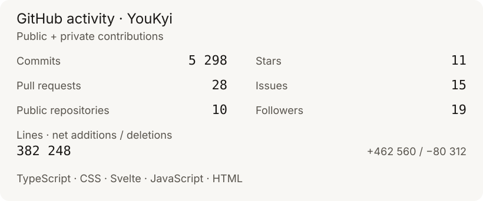

<!-- Identity: git/youkyi-brand · brand.md 1.0.0 · matte neutrals, restrained orange. -->

**English** · [Français](README.fr.md)

## Alexandre Agasseau · @YouKyi

I'm an independent systems administrator. I work on infrastructure and defensive security: Linux, containers, networking, identity and PKI.

I automate, harden and document. Here, I share my configurations and projects around self-hosting.

[Contact me](mailto:contact+github@youkyi.fr) · [LinkedIn](https://www.linkedin.com/in/alexandreagasseau/) · [X](https://x.com/rc_youkyi) · [PGP key](pgp/contact-pub.asc)

## Focus areas

- **Systems & containers** — Linux, virtualization, Docker and Kubernetes.
- **Automation** — reproducible configuration, administration and updates.
- **Defensive security** — hardening, web protection, VPNs and access control.
- **Identity & PKI** — IAM, certificates and chains of trust.

## Tools

| Domain | Stack |
| :--- | :--- |
| Systems & virtualization | Debian, Ubuntu, Proxmox, TrueNAS |
| Containers | Docker, Kubernetes |
| Automation | Ansible, Rudder, Renovate |
| Networking & web protection | Traefik, WireGuard, NetBird, UniFi, BunkerWeb |
| Identity & security | Authentik, step-ca, Wazuh, Splunk |
| Languages & data | Bash, Python, Go, PostgreSQL |

## Self-hosting

My lab is where I work on mail, identity, security and networking.

- **Mail** — Stalwart, Proton Mail; DKIM, DMARC, MTA-STS and DANE.
- **Identity** — Authentik, OIDC, OAuth 2.0, SAML and LDAPS.
- **Security** — Wazuh, step-ca, BunkerWeb and Vault.
- **Networking** — Traefik, Nginx, WireGuard, NetBird and UniFi.

## GitHub activity

<picture>
  <source media="(max-width: 600px)" srcset="assets/stats-en-mobile.svg" />
  
</picture>

View the animated contribution calendar

<picture>
  <source media="(prefers-color-scheme: dark)" srcset="https://raw.githubusercontent.com/YouKyi/YouKyi/output/github-contribution-grid-snake-dark.svg" />
  <source media="(prefers-color-scheme: light)" srcset="https://raw.githubusercontent.com/YouKyi/YouKyi/output/github-contribution-grid-snake.svg" />
  
</picture>

 

